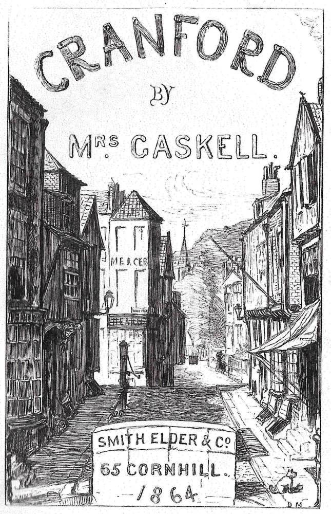
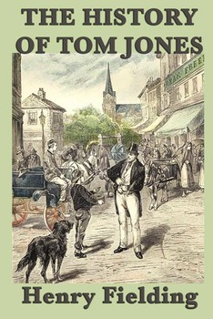
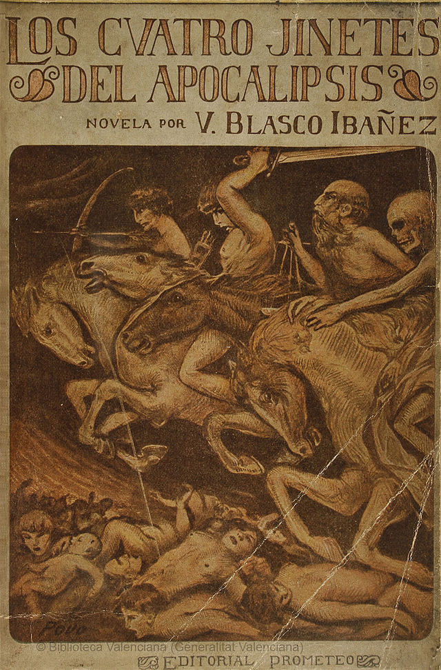

# Book Recommendation System

## Summary of the Project
This project leverages text embeddings to compare and recommend books based on semantic similarity between chunks of text. The system is designed to query book embeddings in English and Spanish, allowing for cross-lingual book recommendations.

---

## Features

1. **Interface with External Data**
   - The project processes text embeddings generated from external APIs (e.g., OpenAI GPT models) and loads them into a database for analysis.

2. **Caching and Database Integration**
   - Uses **PostgreSQL** as the persistent database for storing embeddings and metadata.
   - Placeholder: Integration with a caching layer (e.g., Redis) for optimizing query performance can be added.

3. **Performance Support**
   - System is scalable for handling high read and write requests, depending on the infrastructure setup (e.g., horizontally scalable databases).

4. **Failover Support**
   - Placeholder: Adding failover strategy for zero-downtime data recovery.

5. **Real-World Use Case**
   - Designed to provide cross-lingual book recommendations to researchers, linguists, and readers, making the world a better place by bridging language gaps in literature.

6. **Concurrency and Security**
   - Handles concurrent access by using SQL queries optimized for simultaneous read/write operations.
   - Customer data is safeguarded by excluding sensitive keys from public repositories and ensuring secure access via `.env` configurations.

---

## Current Book Dataset

### English Books

1. **PRIDE, and PREJUDICE**
   - *Summary:* Jane Austen's classic novel explores themes of love, class, and societal expectations through the romantic entanglements of Elizabeth Bennet and Mr. Darcy.
   - 

2. **Middlemarch**
   - *Summary:* George Eliot's intricate tale of life in a provincial English town, showcasing themes of reform, love, and ambition through its ensemble cast.
   - 

3. **A Room With A View**
   - *Summary:* E.M. Forster's novel juxtaposes the constraints of Edwardian England with the liberating beauty of Italy, focusing on Lucy Honeychurch's emotional awakening.
   - 

4. **Cranford**
   - *Summary:* Elizabeth Gaskell paints a charming picture of life in a small English village, full of humor, gossip, and the trials of its residents.
   - 

5. **History of Tom Jones**
   - *Summary:* Henry Fielding’s novel follows the misadventures of Tom Jones, an orphan of mysterious origins, in his journey toward love and self-discovery.
   - 

---

### Spanish Books

1. **Vida De Lazarillo De Tormes Y De Sus Fortunas Y Adversidades**
   - *Summary:* This picaresque novel follows the misadventures of Lázaro, a clever and resourceful boy, as he navigates life in 16th-century Spain.
   - 

2. **Los cuatro jinetes del apocalipsis**
   - *Summary:* Written by Vicente Blasco Ibáñez, this dramatic tale explores the lives of two families during World War I, touching on themes of love, war, and sacrifice.
   - 

3. **Amor y Pedagogía**
   - *Summary:* Miguel de Unamuno’s philosophical novel humorously critiques the idea of scientifically raising a "perfect" human, blending satire with deep introspection.
   - 

4. **EL SOMBRERO DE TRES PICOS**
   - *Summary:* Pedro Antonio de Alarcón’s novella is a lighthearted romantic comedy about misunderstandings and courtship in a small Spanish town.
   - 

5. **La prueba**
   - *Summary:* A tale of love, deception, and societal expectations, La prueba explores human emotions through the lens of Spanish traditions.
   - 

---

## System Design

### Architecture Diagram
Placeholder for the system architecture diagram showing:
- Data ingestion (text embeddings from OpenAI GPT models).
- Storage in PostgreSQL.
- Query flow for finding similar and dissimilar book chunks.

---

### Scaling Bottlenecks
- Bottleneck: Database performance under high read/write loads.
- Solution: Horizontal scaling or caching layer (e.g., Redis).

### Anticipated Limits
- PostgreSQL can handle a limited number of simultaneous connections.
- Embedding vector size (1536) can lead to storage bloat if not compressed or optimized.

---

## Key Learnings

1. **Cross-Lingual Recommendations:**
   - Leveraging embeddings to bridge language gaps in literature is feasible and impactful.

2. **Embedding Storage:**
   - Handling large embedding vectors requires careful database design and indexing.

3. **Scalability Considerations:**
   - A caching layer (e.g., Redis) is crucial for supporting high-performance demands.

---

## Failover Strategy
- **Placeholder:** Implement failover with a managed database (e.g., AWS RDS Multi-AZ) or a replica-based approach.

---

## Performance Characteristics
- **Read Latency:** Currently dependent on PostgreSQL query performance.
- **Write Latency:** Scalable with appropriate database indexing.

---

## Recorded Video Placeholder
[Link to Recorded Video](https://example.com)

---

## How to Run the Project

1. **Clone the Repository:**
   ```bash
   git clone https://github.com/daviethedeveloper/Recommendation.git
   cd Recommendation
   ```

2. **Install Dependencies:**
   ```bash
   pip install -r requirements.txt
   ```

3. **Set Up the Environment:**
   - Create a `.env` file and add your sensitive keys:
     ```
     OPENAI_API_KEY=<your_openai_api_key>
     POSTGRES_URL=<your_postgres_url>
     ```

4. **Run Database Setup:**
   ```bash
   python db_build.py
   python db_insert.py
   ```

5. **Explore the System:**
   ```bash
   python explore_database.py
   ```

6. **Run Analysis:**
   ```bash
   python book_embedding_analysis.py
   ```

---

## Dataset Insights and Comparisons

### 1. Most Similar Chunks to Segment ID 468
**Segment ID 468 belongs to the book: "History of Tom Jones"**

- **Most Similar Chunks:**
  1. Title: *History of Tom Jones*, Chunk Index: 158, Similarity: 0.351660
     > *"unheard. Allworthy stood silent a moment, and then, embracing Jones, he said, with tears gushing fr..."*
  2. Title: *History of Tom Jones*, Chunk Index: 146, Similarity: 0.358514
     > *"especially when the gentleman is your nearest relation; but, sir, you must not be angry with me, you..."*
  3. Title: *History of Tom Jones*, Chunk Index: 159, Similarity: 0.359522
     > *"their expectations, her ladyship should have accepted his offer; but confessed that he had been guilty..."*
  4. Title: *History of Tom Jones*, Chunk Index: 155, Similarity: 0.382054
     > *"thousand times heard me call the young man to whom you are so faithful a friend, my son. Little did..."*
  5. Title: *History of Tom Jones*, Chunk Index: 132, Similarity: 0.389852
     > *"that you already had the legal right you mention; nay, that we had for many years composed that mons..."*

---

### 2. Most Dissimilar Chunks to Segment ID 468

- **Most Dissimilar Chunks:**
  1. Title: *Amor y Pedagogía*, Chunk Index: 22, Similarity: 0.748400
     > *"y cuatro triángulos rectángulos isóceles, tal y como se ve en la adjunta figura en que están marcado..."*
  2. Title: *Amor y Pedagogía*, Chunk Index: 7, Similarity: 0.712573
     > *"¡extraña pedagogía! ¿qué se propondrá este hombre?» --¿Dejarle? --¡Sí, dejarle! ¿Ha sido usted algun..."*
  3. Title: *Amor y Pedagogía*, Chunk Index: 23, Similarity: 0.710322
     > *"del arroyo y las aguas y no que fueron hechos rodados desde un principio para que mejor resistieran..."*
  4. Title: *Vida De Lazarillo De Tormes*, Chunk Index: 3, Similarity: 0.709476
     > *"estómago a escarbar de hambre, viéndose puesto en la dieta pasada. Fue fuera de casa; yo, por consol..."*
  5. Title: *Los cuatro jinetes del apocalipsis*, Chunk Index: 18, Similarity: 0.708830
     > *"las futuras conquistas como si fuesen muestras de distinción con que su país iba á favorecer á los d..."*

---

### 3. Comparison Between Books

#### Comparison: *History of Tom Jones* vs. *Vida De Lazarillo De Tormes Y De Sus Fortunas Y Adversidades*
- **Top 5 Similar Chunks:**
  1. English Chunk 63 ↔ Spanish Chunk 5, Similarity: 0.518100
     - English: *"her many a sigh. This Nanny was extremely pretty, and altogether as coy; for she had refused a drawe..."*
     - Spanish: *"amo en gran recuesta con dos rebozadas mujeres, al parecer de las que en aquel lugar no hacen falta,..."*

  2. English Chunk 78 ↔ Spanish Chunk 5, Similarity: 0.519091
     - English: *"to the door to attend the coach, from which a young lady and her maid now alighted. These the landla..."*
     - Spanish: *"amo en gran recuesta con dos rebozadas mujeres, al parecer de las que en aquel lugar no hacen falta,..."*

  3. English Chunk 79 ↔ Spanish Chunk 5, Similarity: 0.521332
     - English: *"appetite which a fast of twenty-four hours had procured him; but his dinner was no sooner ended than..."*
     - Spanish: *"amo en gran recuesta con dos rebozadas mujeres, al parecer de las que en aquel lugar no hacen falta,..."*

  4. English Chunk 62 ↔ Spanish Chunk 5, Similarity: 0.537063
     - English: *"know, a poor base-born child, adopted by him, and treated as his own son, to dare by my follies to d..."*
     - Spanish: *"amo en gran recuesta con dos rebozadas mujeres, al parecer de las que en aquel lugar no hacen falta,..."*

  5. English Chunk 93 ↔ Spanish Chunk 5, Similarity: 0.542379
     - English: *"went through all the agonies and miseries of a lying-in (ten times more painful in such a circumstan..."*
     - Spanish: *"amo en gran recuesta con dos rebozadas mujeres, al parecer de las que en aquel lugar no hacen falta,..."*

---

### 4. Most Similar Chunks to Segment ID 478
**Segment ID 478 belongs to the book: "A Room With A View"**

- **Most Similar Chunks:**
  1. Title: *A Room With A View*, Chunk Index: 1, Similarity: 0.328878
     > *"quite possible that he, too, may be a Socialist. 'Oh, you relieve me,' said Miss Bartlett. 'So you ..."*
  2. Title: *A Room With A View*, Chunk Index: 11, Similarity: 0.388426
     > *"from his own remarks. Do you remember that day at lunch when he argued with Miss Alan that liking..."*
  3. Title: *A Room With A View*, Chunk Index: 27, Similarity: 0.400570
     > *"discussing Lucy with her. Minnie was fortunately collecting ferns. She opened the discussion with..."*


---
## Feedback and Questions
Feel free to open an issue or ask questions in the GitHub repository or the Discord channel. Feedback is highly encouraged!

--- 
